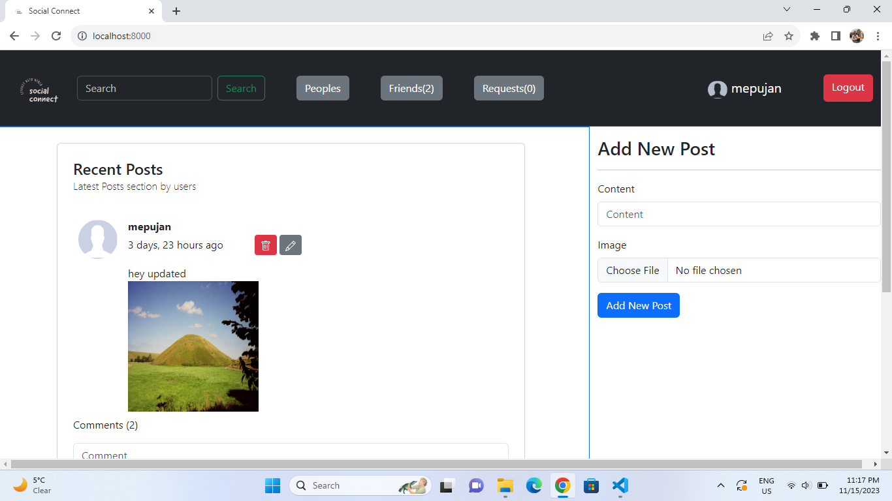

## Social Connect

This is a social media application where you can create your account and create new posts, comments on other users post. User can also edit and delete their post.

  
  

## Features Included

1. Signup and Login
2. Create, Read, Update and Delete Posts
3. Comments on the post
4. Search user by username
5. View other user profile
6. Update and View Own Profile
7. Send Friend request
8. Accept Friend Request
9. Cancel Friend Request

## setting up the project

1. First clone the project using URL

   `https://github.com/mepujan/SocialConnect.git`

2. Install all the requirements from `requirements.txt` file using command

   `pip install -r requirements.txt`

3. Create media folder in project level and upload image file name `avatar.png`. It is used as default value for profile picture
4. Create migrations files using command

   `python manage.py makemigrations`

   `python manage.py migrate`

5. Create superuser using command

   `python manage.py createsuperuser`

   and follow the next input instructions

6. Run the project using command

   `python manage.py runserver`
